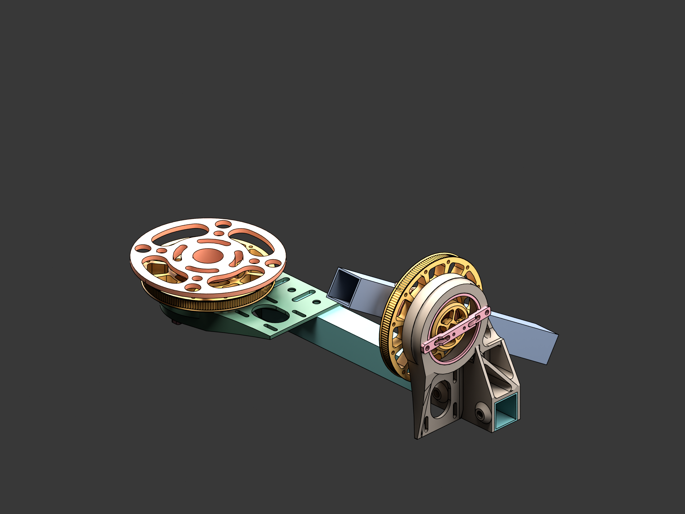
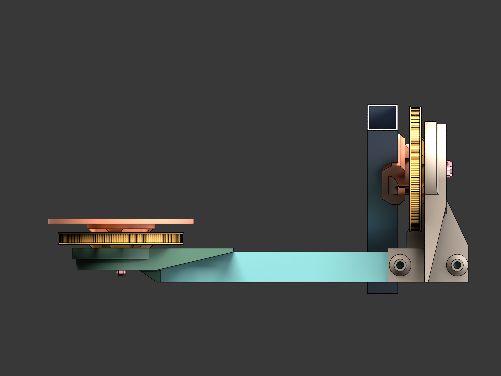
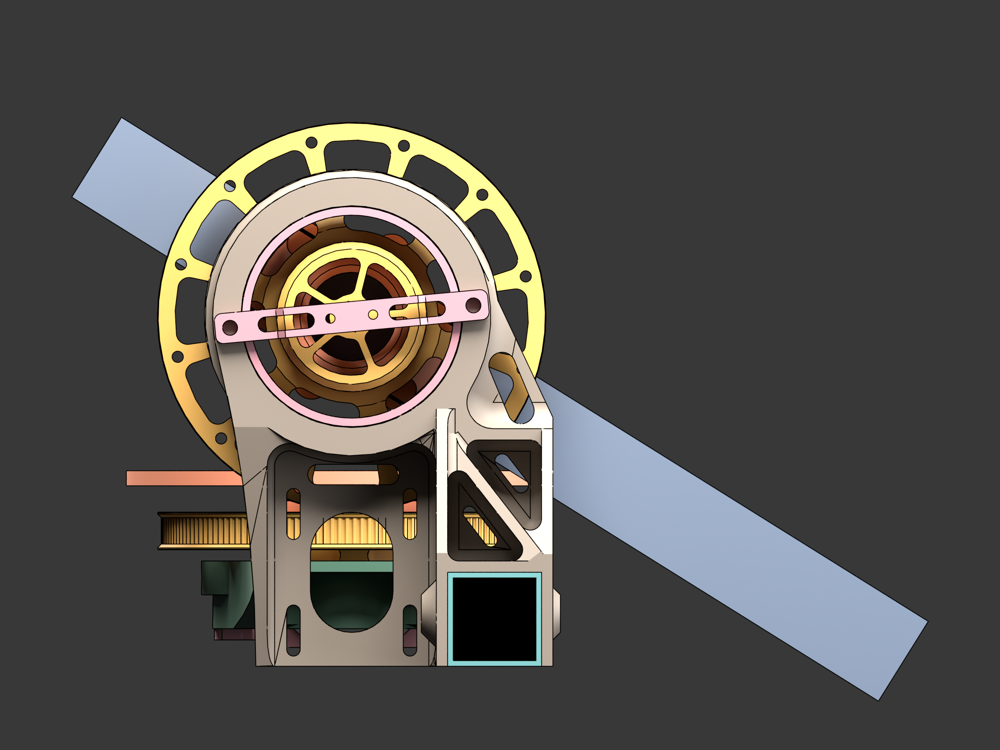
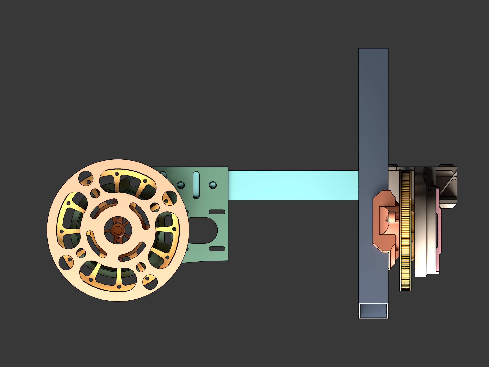

# CAD

3D model files for the Orbiter turntable.

## Files

| File | Format | Use |
|------|--------|-----|
| [`assembly/Orbiter.glb`](assembly/Orbiter.glb) | glTF 2.0 binary | Open in Blender, three.js, any modern 3D viewer. The full hierarchical assembly with named parts. |
| [`assembly/Orbiter.fbx`](assembly/Orbiter.fbx) | FBX | Same as above, in case your toolchain prefers FBX. |
| [`assembly/Orbiter.obj`](assembly/Orbiter.obj) | Wavefront OBJ | Flat opensource format — works in FreeCAD, MeshLab, anything. (Generated from the .glb; see `tools/`.) |
| [`parts/*.stl`](parts/) | STL | Individual 3D-printable parts — drop straight into your slicer. |
| [`screenshots/`](screenshots/) | PNG | Rendered previews of the assembly and each part. |

## Printable parts

| Part | Quantity | Material | Notes |
|------|----------|----------|-------|
| `AxisFrame.stl` | 1 | PLA, 30 % infill | The arm pivot frame. |
| `OrbitFrame.stl` | 1 | PLA, 30 % infill | Main vertical structure. |
| `TableSupportFrame.stl` | 1 | PLA, 25 % infill | Base under the platform. |
| `PlatformInsert.stl` | 1 | PLA, 25 % infill | Top surface for the object. |
| `BarHolderInsert.stl` | 2 | PLA, 30 % infill | Captures the camera arm. |
| `GT2 Pulley.stl` | 2 | PLA, 40 % infill, 0.15 mm layer | 100-tooth output pulley. |
| `Hall Sensor Mount.stl` | 2 | PLA, 25 % infill | Holds the encoder breakouts above the magnets. |

See [`docs/ASSEMBLY.md`](../docs/ASSEMBLY.md) for orientation, infill, and
the order in which the pieces go together.

## Previews



| Front | Side | Top |
|-------|------|-----|
|  |  |  |

Per-part renders are in [`screenshots/`](screenshots/) (`part_*.png`, one
per printable STL).

## Editing the CAD

The model started as a parametric FreeCAD project, then got exported to
FBX for use in the UI's 3D viewer. The `.glb` / `.fbx` / `.obj` files in
this repo are the **distribution format**, not the source.

If you want to modify dimensions:

- For small tweaks (slot widths, screw-hole diameters), edit the STLs in
  Blender or Meshmixer — fine for printable parts.
- For structural changes (arm length, gear ratio), you'll want to
  re-derive in a parametric tool. Import `Orbiter.obj` into FreeCAD as a
  reference mesh, model alongside it, then re-export.

We may publish the FreeCAD source separately later. For now, the printable
geometry is here in formats that anyone can open.

## Regenerating previews & OBJ

The [`render_screenshots.py`](render_screenshots.py) script renders all
of the above and also exports the assembly to OBJ. Run it headless:

```bash
blender --background --python render_screenshots.py
```

It uses Blender's **Workbench** engine (deterministic, no exposure tuning
needed) with `STUDIO` lighting and a neutral grey background. Output goes
to `screenshots/` and `assembly/Orbiter.obj`.
